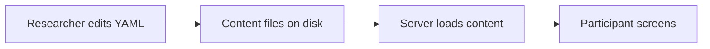

# Move participant copy into editable YAML

## Remember
- Exact file paths always
- Exact commands with expected output
- DRY, YAGNI, TDD, frequent commits
- Delegated tasks must be impossible to misread.

## Overview

Study participants see wording that is written in TypeScript and React files today. The work moves that wording into YAML files in the UI app, so a researcher can edit sentences without opening a component file. Shared screen text goes in one file. The sample session's issue, persona, and scripted replies go in a second file. The participant journey, demo session ids, and mocked conversation behavior stay the same. The screens should look the same.

## Happy flow

A researcher changes a heading, an unavailable message, the issue prompt, or a scripted AI reply in a YAML file, then refreshes the Next.js app and sees the new text on the matching screen.

## Approach

Use two YAML files. One file holds labels and messages that are the same on every session, such as home, introduction labels, audio check, conversation controls, completion, and unavailable. The other file holds the sample session's issue text, persona, opening line, scripted replies, and completion next step.

The server reads those files and passes the strings into the screens. Demo ids that only change status (`expired-demo`, `completed-demo`, `paused-demo`) keep using the small overlay that already lives in session lookup. Do not add a third YAML index, a translation library, or new helper APIs for microphone errors and remaining-time phrases. Leave those short system strings in the code that already returns them.

The YAML parser package is already listed in the UI app. Use it. Do not change layout, routes, or the session lookup function that pages already call, except to read the session YAML and to load the complete page on the server.

## Steps

### Step 1: Add two YAML files and a loader

Write the two YAML files from today's wording. Add a server loader that reads them, checks required keys, and throws if a key is missing. Add tests for the loader. Do not change screens yet.

Details: [steps/step1.md](steps/step1.md)

### Step 2: Load the sample session from YAML

Point session lookup at the session YAML file. Keep the same demo ids. Load the complete page's session on the server, because the lookup will read files and must not run in the browser.

Details: [steps/step2.md](steps/step2.md)

### Step 3: Load shared screen text from YAML

Replace hardcoded participant sentences on the screens with strings from the shared YAML file. Fill a React context from the root layout so client screens can read those strings. Capture screenshots before you edit the screens.

Details: [steps/step3.md](steps/step3.md)

### Step 4: Document where to edit wording, then run checks

Point the setup and run docs at the two YAML files. Confirm lint, tests, and the production build pass. Confirm the before and after screenshots from step 3.

Details: [steps/step4.md](steps/step4.md)

## What "done" looks like

1. Shared screen text lives in `ui/content/ui-copy.yaml`.
2. Sample session study text lives in `ui/content/sessions/demo-campus-speech-001.yaml`.
3. React screens render those strings instead of owning the long participant sentences.
4. `demo-campus-speech-001`, `expired-demo`, `completed-demo`, and `paused-demo` still behave as they do today.
5. Editing YAML and refreshing the app is enough to change on-screen wording.
6. UI tests, lint, and the production build pass from `ui/`.
7. The run and setup docs name the two YAML files.
