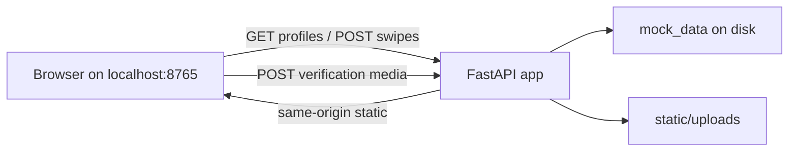

# Build a localhost Tinder-like mock app in mock_app

## Remember
- Exact file paths always
- Exact commands with expected output
- DRY, YAGNI, TDD, frequent commits
- Delegated tasks must be impossible to misread.

## Overview

Add a self-contained experimental swipe app under `/workspace/mock_app/` only. A local FastAPI server on port 8765 serves a vanilla HTML swipe UI and JSON APIs from the same origin. Profiles carry rich fields (bio, photos, work, education) plus two boolean verification tags. Mock profiles and sample images live on disk. Users verify LinkedIn and Trust Source by uploading a photo and/or video for the fixed “current user” profile. No deployment, no changes outside `mock_app/`.

## Happy flow

Open the app in a browser, swipe through mock profiles with like/pass, inspect work and education and verification badges, then open the verification panel, upload media, and see the current user’s badges turn on after refresh.

## Approach

Keep the stack minimal: FastAPI, Pydantic models, JSON file store, and disk uploads. Write failing API tests before handlers. Serve the frontend from the same process to avoid cross-origin issues. Split work so backend contracts and mock seed land first, then profiles and swipes, then verification uploads, then swipe UI, then verification UI and run docs. Steps 2→3 and 4→5 are sequential where they touch `main.py` or frontend files.

## Steps

### Step 1: Scaffold, contracts, and mock data seed

Create the folder tree, Python project metadata, configuration module, profile data shapes, sample `profiles.json`, placeholder photos, and upload directories. No HTTP routes yet.

Details: [steps/step1.md](steps/step1.md)

### Step 2: Profiles and swipes API with tests

Implement the JSON data store, profile and swipe routers, and a `main.py` that exposes health, profile listing, current user, and swipe recording. Test-first.

Details: [steps/step2.md](steps/step2.md)

### Step 3: Verification upload API, static mounts, tests

Add file save service, verification router, upload directory mounts, and tests. Extend `main.py` only for uploads and mock photo static paths. Runs after step 2.

Details: [steps/step3.md](steps/step3.md)

### Step 4: Swipe UI with work, education, and badges

Build the card-stack frontend that calls the profiles and swipes APIs. No verification upload UI yet.

Details: [steps/step4.md](steps/step4.md)

### Step 5: Verification UI, frontend mount glue, README

Add the verification upload panel, wire `main.py` to serve the frontend same-origin, finalize README run instructions, and confirm end-to-end localhost flow.

Details: [steps/step5.md](steps/step5.md)

## What "done" looks like

1. All code and assets live under `/workspace/mock_app/`; `/workspace/ui/`, `/workspace/backend/`, and deploy configs are untouched.
2. `uvicorn` on `127.0.0.1:8765` serves API, mock photos, uploads, and the static frontend without CORS.
3. At least three mock profiles in `mock_data/profiles.json` with on-disk sample images.
4. Swipe UI shows name, bio, photos, work history, education, and both verification badges.
5. Uploading photo and/or video for LinkedIn or Trust Source sets the corresponding tag on the current user and persists upload paths.
6. `pytest` passes for profiles, swipes, and verifications.
7. README documents install, run, and manual happy-path verification.
