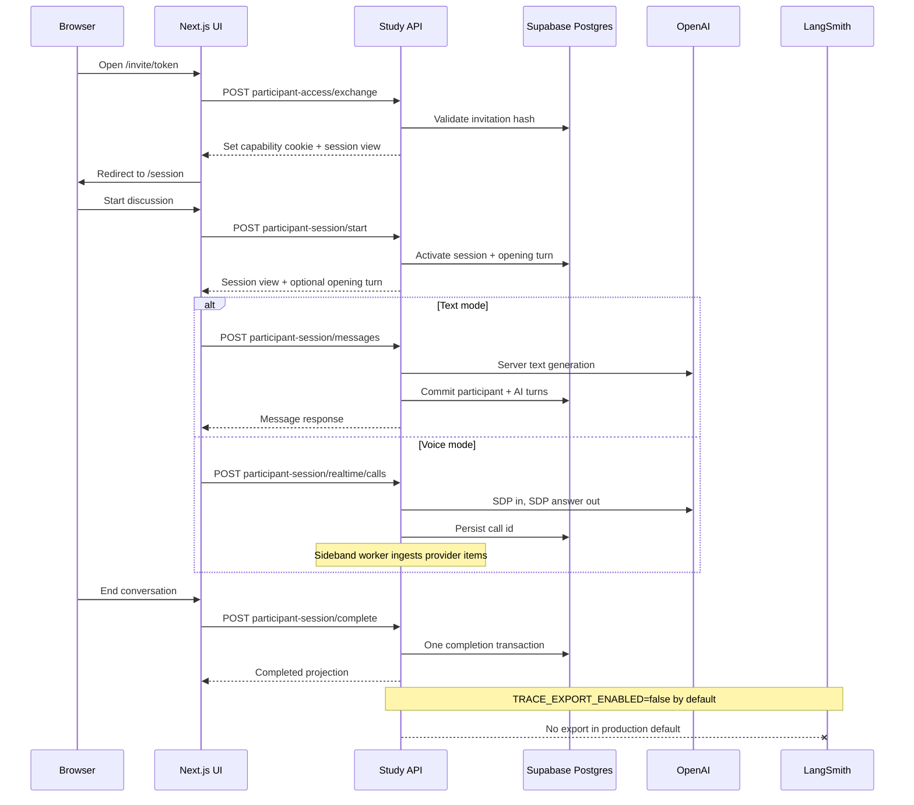

# Build the Study API and LangSmith telemetry

## Remember
- Exact file paths always
- Exact commands with expected output
- DRY, YAGNI, TDD, frequent commits
- Delegated tasks must be impossible to misread.

## Overview

This plan turns the current FastAPI health stub on Railway into a full Study API backed by Supabase Postgres. It then wires the Next.js participant UI to real HTTP contracts and adds LangSmith hook points with export disabled by default. Work follows the frozen proposals in `strategy_planning/` and the orchestration rules in `INSTRUCTIONS_TO_BUILD_BACKEND.md`. The sample protocol does not require stored consent before start unless the configuration snapshot says so. Staff admin screens stay out of scope, and staff JSON Web Token verification may be stubbed on export routes only.

## Happy flow

A participant opens an invitation link, and the browser exchanges the token for a capability cookie. The participant walks through introduction and audio check without a session id in the URL, starts the session, and sends text or voice through server-mediated paths. After the participant completes the session, the UI shows a grace-period completion view. The Study API commits canonical turns to Supabase Postgres. LangSmith receives nothing in production until an approved trace policy is in place and `TRACE_EXPORT_ENABLED=true` is set on purpose.

## Approach

Build in strict dependency order across shared milestones. First freeze routes and models in memory. Second move authority to Supabase Postgres. Third add voice and text integrations. Fourth attach tracing hooks with export off. Fifth add minimal research export hooks. Sixth rewire the UI to routes that use capability cookies instead of a public session id. Seventh deploy and document. Each step file is a self-contained packet for one subagent. Steps run sequentially. Only one step may edit `pyproject.toml`, `conftest.py`, or `router.py` at a time. See the implement order below. Prefer direct OpenAI calls with optional LangSmith wrapping. Do not add LangGraph unless a later step proves it is required.

## Implement order

Run steps in this order only:

1. Step 1: Backend foundation and shared contracts
2. Step 2: Sample contracts with in-memory participant API
3. Step 3: Supabase schema and repository layer
4. Step 4: Durable record wiring and completion transaction
5. Step 5: Server-mediated text generation
6. Step 6: Voice control plane and internal ingest
7. Step 7: LangSmith tracing hooks with export disabled
8. Step 8: Research export hooks and staff JWT stub
9. Integration check: full backend test suite, merge conflicts on shared files, and smoke of text plus voice paths
10. Step 9: Participant UI wiring to the Study API
11. Step 10: Deploy, environment docs, and integration smoke

## Shared file ownership

These files are touched in more than one step over the plan. Only the listed step may edit each file during its turn.

| File | Owning step | What that step may do |
| --- | --- | --- |
| `/workspace/backend/pyproject.toml` | Step 1 | Initial package layout and dev dependencies |
| `/workspace/backend/pyproject.toml` | Step 2 | Add `itsdangerous` or equivalent for CSRF |
| `/workspace/backend/pyproject.toml` | Step 3 | Add `sqlalchemy`, `asyncpg`, and related DB deps |
| `/workspace/backend/pyproject.toml` | Step 5 | Add `openai` |
| `/workspace/backend/pyproject.toml` | Step 6 | Add `httpx` if needed |
| `/workspace/backend/pyproject.toml` | Step 7 | Add `langsmith` |
| `/workspace/backend/tests/conftest.py` | Step 1 | Baseline pytest fixtures |
| `/workspace/backend/tests/conftest.py` | Step 2 | Participant client helpers |
| `/workspace/backend/tests/conftest.py` | Step 3 | Postgres test fixture or skip marker |
| `/workspace/backend/tests/conftest.py` | Step 4 | `storage_mode` parametrization |
| `/workspace/backend/tests/conftest.py` | Step 5 | Mock OpenAI client fixture |
| `/workspace/backend/tests/conftest.py` | Step 6 | Worker auth header fixture |
| `/workspace/backend/tests/conftest.py` | Step 7 | Fake LangSmith client fixture |
| `/workspace/backend/app/api/router.py` | Step 1 | Initial router mount for health |
| `/workspace/backend/app/api/router.py` | Step 2 | Register participant routers |
| `/workspace/backend/app/api/router.py` | Step 6 | Mount internal worker router |
| `/workspace/backend/app/api/router.py` | Step 8 | Mount `/v1/staff` router group |

## Steps

### Step 1: Backend foundation and shared contracts

You lay out the FastAPI package, shared error envelope, configuration loader, health and readiness routes, and baseline tests so later slices import stable types.

### Step 2: Sample contracts with in-memory participant API

You implement every participant route from the backend proposal against an in-memory store with scripted text replies and a fake voice answer. You do not use Postgres, live OpenAI, or LangSmith in this step.

### Step 3: Supabase schema and repository layer

You add SQL migrations under `supabase/migrations/`, database connection settings, and repository modules that map storage records to the frozen domain models.

### Step 4: Durable record wiring and completion transaction

You point participant routes at Postgres repositories, enforce the session state machine, writer lease, idempotency, immutable turns, and atomic completion. You run the same contract tests against memory and Postgres via a test flag.

### Step 5: Server-mediated text generation

You replace scripted AI replies with a server-owned OpenAI text path, generation operation states, and contract tests for retry and conflict behavior.

### Step 6: Voice control plane and internal ingest

You add Realtime call setup that returns SDP only, persist provider call ids, accept internal worker item posts, and stub or run the sideband worker for staging.

### Step 7: LangSmith tracing hooks with export disabled

You add a tracing service interface, hook calls after committed generations, UUID v7 telemetry thread ids at invitation, payload denylist, and `TRACE_EXPORT_ENABLED=false` as the default no-op exporter.

### Step 8: Research export hooks and staff JWT stub

You add versioned export manifest types, a minimal staff export route that verifies a forwarded Supabase JSON Web Token stub, and tests that exports come only from committed Postgres rows.

### Integration check (after Step 8, before Step 9)

Run the full backend test suite. Confirm no merge conflicts remain on `pyproject.toml`, `conftest.py`, or `router.py`. Smoke text generation and voice ingest paths end to end. Do not start UI wiring until this check passes.

### Step 9: Participant UI wiring to the Study API

You replace YAML-only session loading with `/invite/[token]` exchange, cookie-scoped `/session/*` routes without a public session id in the path, and real fetch calls for start, messages, transcript, complete, and voice setup.

### Step 10: Deploy, environment docs, and integration smoke

You document required Railway and Vercel environment variable names without secret values, add runbook updates, deploy the API service, and run smoke checks against health and one authenticated participant path.

## What "done" looks like

- Railway serves a Study API that implements the participant route table from `strategy_planning/backend_proposal_2026_08_06.md`, not a hello world stub.
- Supabase Postgres holds sessions, snapshots, canonical turns, observations, leases, and audit rows. Railway Postgres is not used.
- The sample protocol starts without a consent gate unless the snapshot requires one.
- The UI uses `/invite/[token]` then `/session`, `/session/audio-check`, `/session/conversation`, and `/session/complete` with capability cookies. No internal session id appears in public URLs.
- Text mode creates AI turns only on the server. The browser cannot post AI or system turns. There is no public turn upsert route.
- Voice mode returns SDP answers only. Internal worker ingest maps provider items to canonical turns.
- LangSmith hook points exist. `TRACE_EXPORT_ENABLED` defaults to false. Opening snapshot content is not exported as a generation trace.
- Contract tests cover authz, immutability, completion atomicity, trace payload denylist, and consent gating when enabled.
- Environment variable names are documented in git without secret values. Production `/health` and at least one credentialed participant path pass smoke checks.
